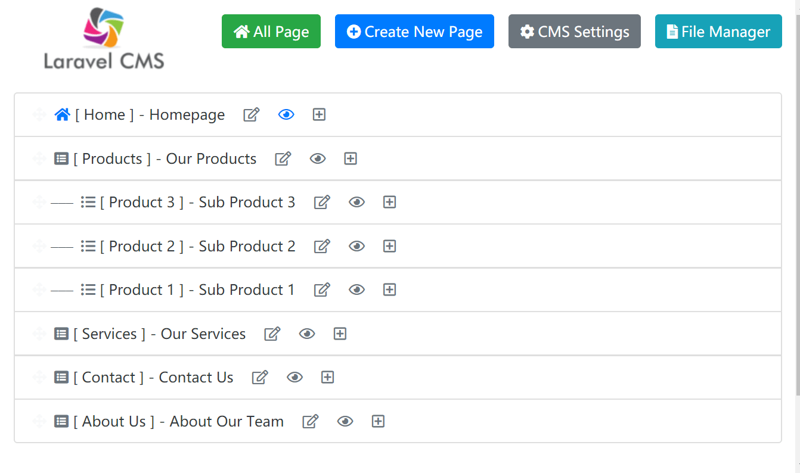

# Amila Laravel CMS

-   Simple Laravel CMS for any EXISTING or new Laravel website.
-   Only add a few database tables with prefix, not effect your existing database tables.
-   You can easy custom the database table names, the page URL path(route) and the template(theme)
-   Website is ready after install. Easy to use, simple enough but flexible.
-   Basic Laravel syntax and habit, no need to learn a new "language"

## How to install & uninstall

```php
// Go to the laravel project folder and install it via composer
// Initialize the CMS (You can set up database table prefix and locale here)
composer require alexstack/laravel-cms && php artisan laravelcms

// Now you can access the cms frontend site: http://yourdomain/cms-home

// Access the backend with the FIRST USER of your site: http://yourdomain/cmsadmin

// Uninstall the CMS
php artisan laravelcms --action=uninstall

```

## Screenshot of the output of install command


## Screenshot of the output of uninstall command


## Screenshot of the admin panel




## Error "Route [login] not defined" while access the backend /cmsadmin

-   This means you did not install Laravel Auth
-   Fix it by below commands:

```php
php artisan make:auth
php artisan migrate
```

## Why the uploaded image can not display (404 error)

-   You can fix it by create a storage public link
-   php artisan storage:link

## Custom the cms route in config/laravel-cms.php

-   **homepage_route**: This is the frontend homepage. By default it is /cms-home, you can change it to / after remove the existing / route in the routes/web.php
-   **page_route_prefix**: This is the frontend page prefix. By default it is /cms-, it will match path like /cms-\*. You can change it to a folder like /xxx/ or anything like xxx-, eg. Page- Article-
-   **admin_route**: This is the backend admin page route, By default it is /cmsadmin
-   After change the route, you will need to run below commands:
    -   php artisan config:cache
    -   or
    -   php artisan optimize

## Display an image with different size in the frontend Laravel .blade.php template file

-   .blade.php Code examples:

```php
@if ( isset($file_data->main_image) )
    imageUrl($file_data->main_image, '1000') }}" class="img-fluid" />

    imageUrl($file_data->main_image, '500') }}" class="img-fluid" />

    imageUrl($file_data->main_image, 'w', '150') }}" class="img-fluid" />

    imageUrl($file_data->main_image, '100', '100') }}" class="img-fluid" />

    imageUrl($file_data->main_image, 'original', 'original') }}" class="img-fluid" />

@endif

```

-   You can get an image with any width and height. or use the original image.
-   Available image variables: $file_data->main_image, $file_data->main_banner, $file_data->extra_image, $file_data->extra_image_2
-   The CMS will resize the image at the first time, then will directly use it afterwards.

## How to change the CSS & JS assets of the frontend?

-   The asset files located at public/laravel-cms/<theme_name>, eg. public/laravel-cms/frontend/css
-   Example code to load css or js:

```php
<link rel="stylesheet" href="{{ $helper->assetUrl('css/main.css') }}">
...
<script src="{{ $helper->assetUrl('js/bottom.js') }}"></script>
```

-   The default template file will load css and js asset with last_modify_time parameter to avoid cache from browser

## How to set up a different template theme from the default?

-   Copy the default theme folder /resources/views/laravel-cms/**frontend** to /resources/views/laravel-cms/**new_theme**
-   Change the frontend_dir in the settings page to **new_theme**
-   Default value in config/laravel-cms.php

```php
    'template' => [
        'frontend_dir'      => 'frontend',
        'backend_dir'       => 'backend',
        'backend_language'  => 'en',
        'frontend_language' => 'en',
    ]
```

-   run **php artisan config:cache** to load new config file
-   Change template settings for the pages in the backend
-   The css/js asset files will locate at public/laravel-cms/**new_theme**

## Set default slug format and suffix for page SEO URL in config/laravel-cms.php

-   You can change it in the settings page
-   'slug_format' can be from_title, id, pinyin
-   'slug_suffix' can be anything you want, empty means no suffix

```php
    'slug_format'   => 'from_title',
    'slug_suffix'   => '.html',
    'slug_separate' => '-',
```

## License

-   MIT

```

```
