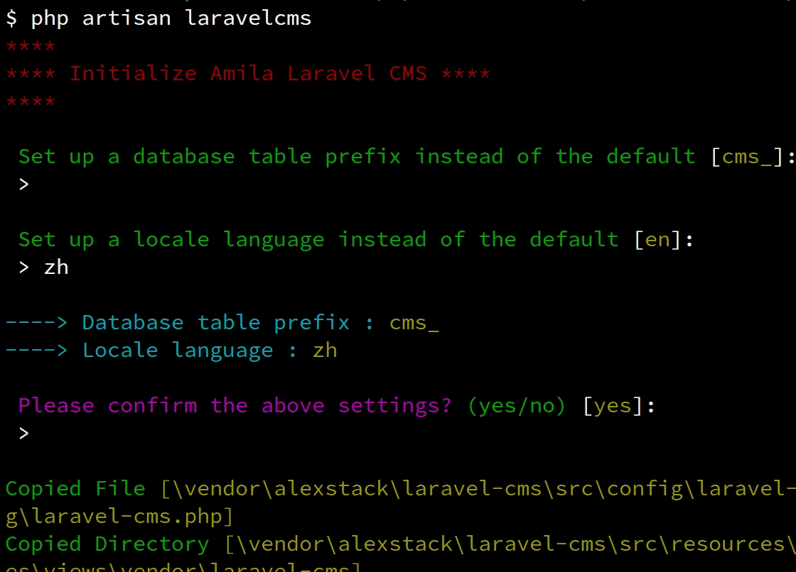
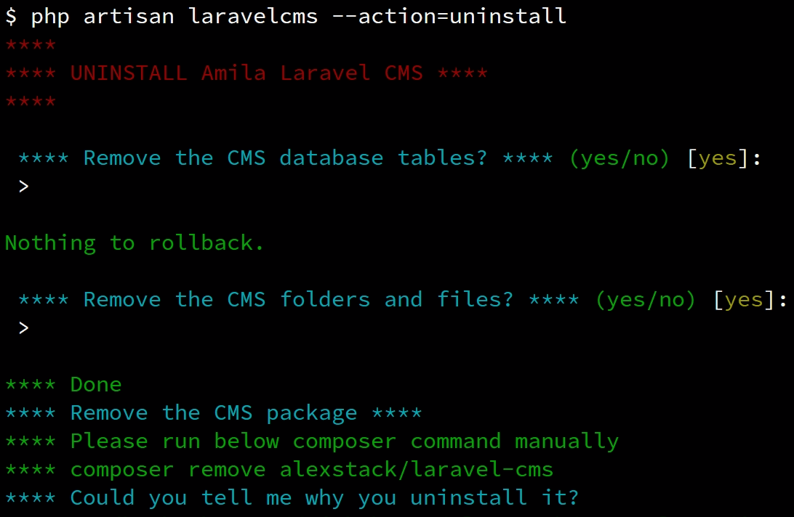
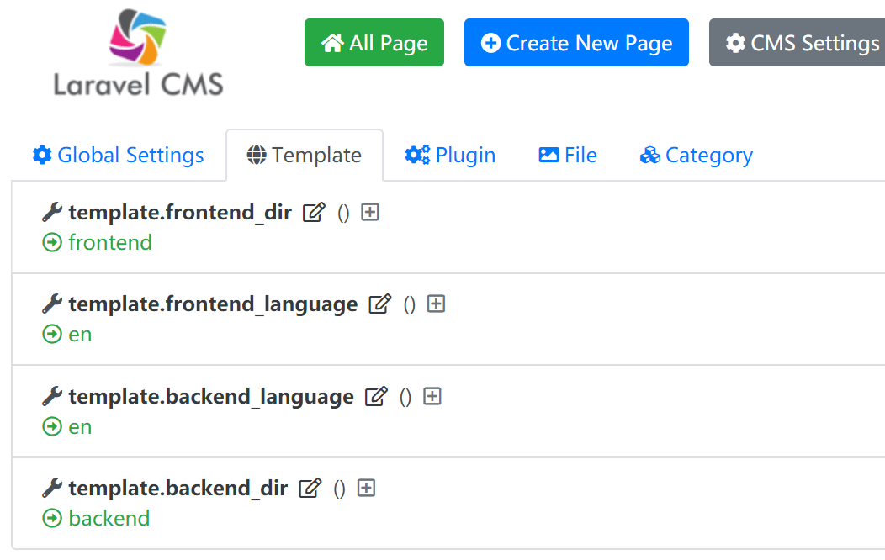
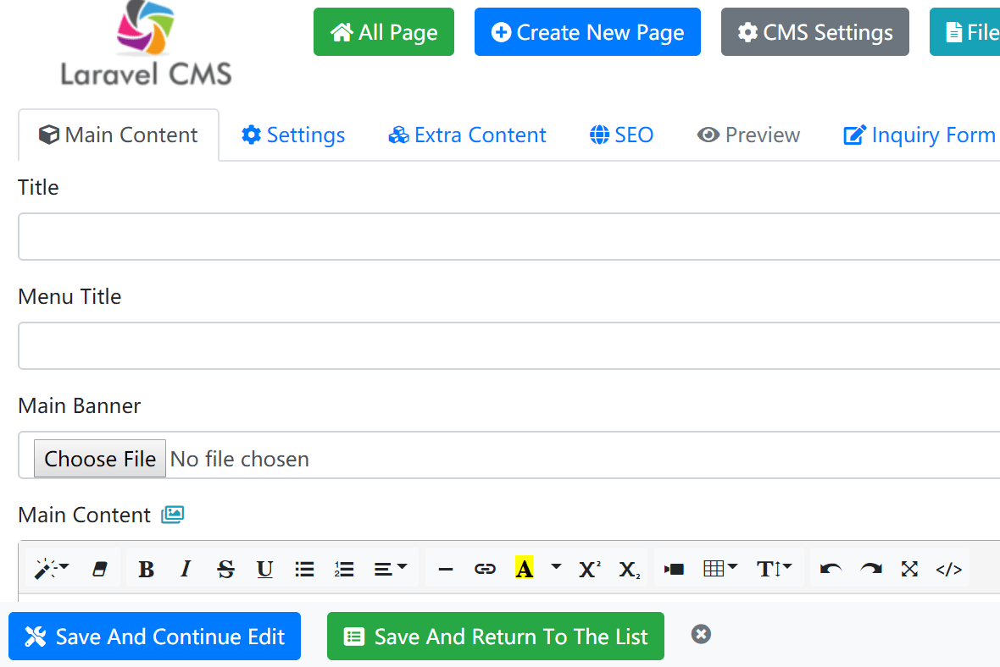
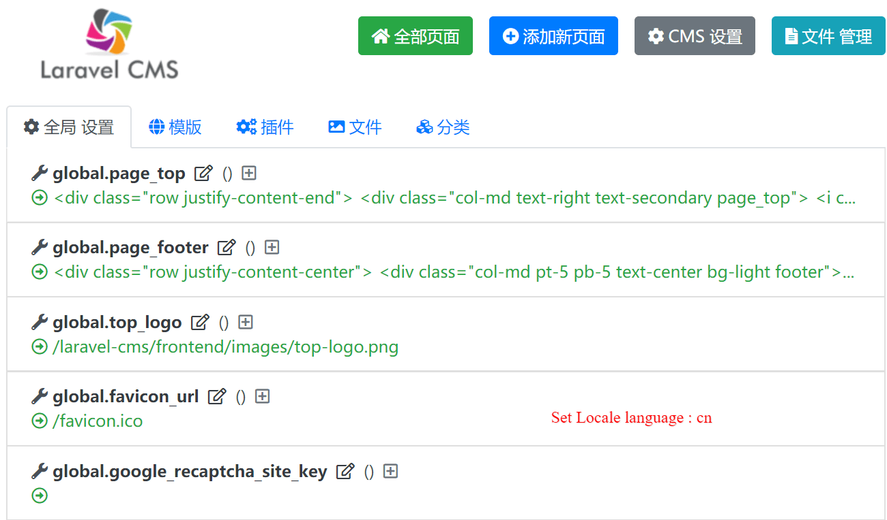
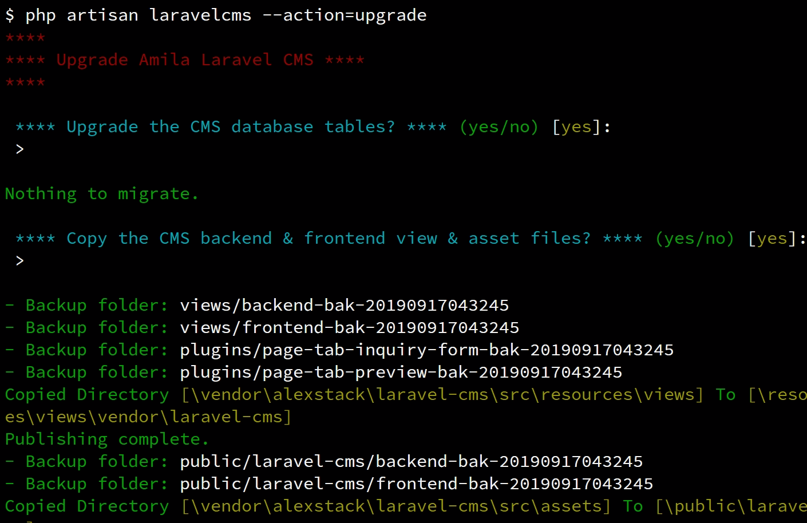

# Amila Laravel CMS

[](https://github.com/AlexStack/Laravel-CMS/releases)
[](https://www.laravelcms.tech/ "Laravel CMS 2020")
[](https://github.com/AlexStack/Laravel-CMS/releases)
[](https://github.com/AlexStack/Laravel-CMS/releases)

-   Free, open-source Simple Bootstrap Laravel CMS, support Laravel 8.x or 7.x or old Laravel 6.x & 5.x
-   Can integrate with any existing Laravel project, install as an individual Laravel package
-   Only add a few database tables with a prefix, not effect your existing database tables.
-   You can easily custom the database table names, the page URL path(route) and the template(theme)
-   Build-in Website is ready after install. Easy to use, simple enough but flexible.
-   Basic Laravel 8.x/ Laravel 7.x /Laravel 6.x / Laravel 5.x syntax and blade template, no need to learn a "new language"

## How to install for an existing Laravel project
- Support Laravel 8.x & Laravel 7.x & Laravel 6.x & Laravel 5.x

```php
// Make sure you already have laravel installed and configured the database in the .env
// Go to your laravel project folder and install it via composer
// Initialize the CMS (You can set up database table prefix and locale here)

composer require alexstack/laravel-cms && php artisan laravelcms


// Now you can access the cms frontend site: http://yourdomain/cms-home

// Access the backend with the FIRST USER of your site: http://yourdomain/cmsadmin
```

## How to set up a brand new CMS website with the latest Laravel

-   It's good for a local testing, it's support the latest Laravel version

```php
// Step 1: Install Laravel to folder cms
composer create-project laravel/laravel cms && cd cms && composer require alexstack/laravel-cms

// Step 2: Change the database connection settings in the .env
vi .env // change DB_DATABASE, DB_USERNAME, DB_PASSWORD

// Step 3: install CMS
php artisan laravelcms  --silent=yes

// Step 4: Enable Laravel auth/login system
composer require laravel/ui && php artisan ui bootstrap --auth && php artisan migrate

// Step 5: Set up a web server via php artisan
php artisan serve

// Step 6: Now, you can access your cms backend via http://127.0.0.1:8080/cmsadmin/

// Tips: You will need to register a new user and the first user will be the admin user of the cms

// Tips: You can initialize the CMS with silent mode
php artisan laravelcms --action=initialize --locale=en --table_prefix=cms_  --silent=yes

```


## How to uninstall
```php
// Uninstall the CMS
php artisan laravelcms --action=uninstall

```

## Demo & Documents

-   [Laravel CMS frontend demo & documents](https://www.laravelcms.tech "Laravel CMS") &#x1F4D9;

## Screenshot of the output of install command



## Screenshot of the output of uninstalling command



## Screenshot of the admin panel





## Set locale language to **cn** instead of **en**



## Error "Route [login] not defined" while access the backend /cmsadmin/

-   This means you did not install Laravel Auth(User system)
-   Can be fixed by the below commands:

```php
// Laravel 6.x & Laravel >= 7 & Laravel >= 8
composer require laravel/ui && php artisan ui vue --auth
// Laravel 5.x, run blow command instead
php artisan make:auth && php artisan migrate
```

-   After install the Auth package, please register the first user as the admin

## How to log into the backend /cmsadmin/?

-   Amila CMS use your existing Laravel user system
-   You need to log in with the FIRST USER of your site (user_id = 1)
-   You can add more admin users by change the admin_ary in config/laravel-cms.php
-   If you don't have any existing user, then register a new one via http://your-domain/register

## Why the uploaded image can not display (404 error)

-   You can fix it by creating a storage public link
-   **php artisan storage:link**
-   eg. The public/storage should link to ../storage/app/public, if the public/storage is a real folder, you should remove/rename it and run "php artisan storage:link" to set up the link.

## Custom the cms route in config/laravel-cms.php

-   **homepage_route**: This is the frontend homepage. By default it is /cms-home, you can change it to / then remove the existing / route in the routes/web.php

```php
# Change homepage_route to /  in config/laravel-cms.php
'homepage_route'    => env('LARAVEL_CMS_HOMEPAGE_ROUTE', '/'),

# Remove the existing / route in the routes/web.php

// Route::get('/', function () {
//     return view('welcome');
// });
```

-   **page_route_prefix**: This is the frontend page prefix. By default it is /cms-, it will match path like /cms-\*. You can change it to a folder like /xxx/ or anything like xxx-, eg. Page- Article-

```php
'page_route_prefix' => env('LARAVEL_CMS_PAGE_PREFIX', '/Article-'),
```

-   **admin_route**: This is the backend admin page route, By default, it is /cmsadmin

```php
'admin_route'       => env('LARAVEL_CMS_BACKEND_ROUTE', '/admin2019'),
```

-   **After changing the route, you will need to run below commands:**

```php
php artisan laravelcms --action=clear
```

## Display an image with different size in the frontend Laravel .blade.php template file

-   .blade.php Code examples:

```php
@if ( isset($file_data->main_image) )
    imageUrl($file_data->main_image, '1000') }}" class="img-fluid" />

    imageUrl($file_data->main_image, '500') }}" class="img-fluid" />

    imageUrl($file_data->main_image, 'w', '150') }}" class="img-fluid" />

    imageUrl($file_data->main_image, '100', '100') }}" class="img-fluid" />

    imageUrl($file_data->main_image, 'original', 'original') }}" class="img-fluid" />

@endif

```

-   You can get an image with any width and height. or use the original image.
-   Available image variables: $file_data->main_image, $file_data->main_banner, $file_data->extra_image, $file_data->extra_image_2
-   The CMS will resize the image at the first time, then will directly use it afterwards.

## How to change the CSS & JS assets of the frontend?

-   The asset files located at public/laravel-cms/<theme_name>, eg. public/laravel-cms/frontend/css
-   Example code to load css or js:

```php
<link rel="stylesheet" href="{{ $helper->assetUrl('css/main.css') }}">
...
<script src="{{ $helper->assetUrl('js/bottom.js') }}"></script>
```

-   The default template file will load CSS and js asset with last_modify_time parameter to avoid cache from the browser

## How to set up a different template theme from the default?

-   Copy the default theme folder /resources/views/laravel-cms/**frontend** to /resources/views/laravel-cms/**new_theme**
-   Change the frontend_dir in the settings page to **new_theme**
-   Default value in config/laravel-cms.php

```php
    'template' => [
        'frontend_dir'      => 'frontend',
        'backend_dir'       => 'backend',
        'backend_language'  => 'en',
        'frontend_language' => 'en',
    ]
```

-   run **php artisan config:cache** to load new config file
-   Change template settings for the pages in the backend
-   The css/js asset files will locate at public/laravel-cms/**new_theme**

## Set default slug format and suffix for page SEO URL in config/laravel-cms.php

-   You can change it in the settings page
-   'slug_format' can be from_title, id, pinyin
-   'slug_suffix' can be anything you want, empty means no suffix

```php
    'slug_format'   => 'from_title',
    'slug_suffix'   => '.html',
    'slug_separate' => '-',
```

## Use your own PHP class / How to integrate your PHP code into the CMS

-   One simple option is to implement a method from your own PHP controller/class by adding it into a cms page. [Tutorial for it.](https://www.laravelcms.tech/Laravel-Advanced-Override-the-page-content-by-your-PHP-Class-method-function.html "Use your PHP class in a Laravel CMS page")
-   Another option is to create a CMS plugin for your own project and use it for all pages. [A tutorial is here.](https://www.laravelcms.tech/Laravel-Create-your-own-plugin.html "How to create a Laravel CMS Plugin") You can also publish the plugin if the feature can be used by other websites.


## How to upgrade the CMS?

-   Run below command in your Laravel project folder
-   It will ask whether you want to copy the new view, asset and language files to your project

```php
composer require alexstack/laravel-cms && php artisan laravelcms --action=upgrade
```

-   Upgrade screenshot



## ReactJS for backend All Pages list

-   Laravel CMS use ReactJS for backend All Pages list, [the ReactJS source code can be found here](https://github.com/AlexStack/Laravel-CMS/tree/alex_dev/src/resources/reactJs)
-   The compiled js file is here: /public/laravel-cms/backend/js/reactLaravelCmsBackend.js
-   It can be switch to normal Laravel blade page by change the "react_js": true to false in the setting system.all_pages

## What PHP versions do you support?

-   Amila Laravel CMS passed the basic test on PHP 7.1, 7.2, 7.3, 7.4

## License

-   The Amila Laravel CMS is open-source software licensed under the MIT license.
